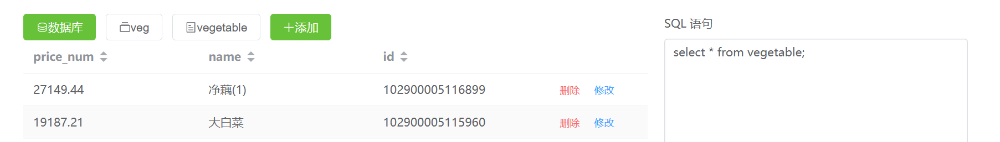

# minidbms

## 介绍
✨基于 Vue3 和 SpringBoot2 的微型数据库管理系统 (miniDBMS) ✨ 采用 vue3 + springboot2 前后端分离的架构设计并开发了一个 DBMS 系统，设计了表的构造及其存储模式，能够对用户输入的 SQL 语句进行编译处理，实现了数据库的DQL数据查询、DDL数据定义、DML数据操作等功能，并且用户能够在 WEB 前端通过图形界面和 SQL 语句两种方式，便捷地操作数据库。📌小组的数据库原理课程设计仓库。

[个人网站：www.bytesc.top](http://www.bytesc.top) 

[个人博客：blog.bytesc.top](http://blog.bytesc.top)

🔔 如有项目相关问题，欢迎在本项目提出`issue`，我一般会在 24 小时内回复。

## 效果展示

WEB 前端界面


可以通过图形界面按钮操作，解析出SQL语句，实现基本的增删改查 (CRUD)


动态面包屑导航，记录当前的数据库访问状态。




也可以直接输入SQL语句实现高级数据库操作，例如多表查询。


创建数据库：create database 数据库名


创建表：create table 表名 (列名称1 数据类型，列名称2 数据类型,......)


多表条件投影查询：select price_num,name,id from category,vegetable where id=id;


测试所用的 `SQL` 语句可见 [`./test_sql.txt`](./test_sql.txt)

## 架构说明

### 前端


基于Vue3：用户能够在 WEB 前端通过图形界面和 SQL 语句两种方式，便捷地操作数据库。
- element-UI 渲染界面组件和数据；
- JavaScript 把用户在图形界面的按钮操作解析为 SQL 语句；
- Axios 与 SpringBoot2 后端异步通信，发送需要执行的 SQL 语句，接收返回的执行结果，并根据返回结果的类型动态渲染页面。

详细说明可见 [前端架构详细说明](./minidbms-front/README.md)

#### 前端运行方法
在安装 Node.js 的前提下
```bash
cd minidbms-front/
npm install
npm run dev
```

前端部分由以下人员独立开发：
* https://github.com/bytesc

### 后端

基于 SpringBoot2 的后端 api

后端部分由以下人员独立开发：
* https://github.com/originNis


### 数据库模块

基于 Java 和 XML 文件：能够对用户输入的 SQL 语句进行编译处理，实现了数据库的 DQL 数据查询、DDL 数据定义、DML 数据操作等功能。

数据库模块部分基于开源项目开发：
* https://github.com/lerry-lee/simple-dbms

数据库模块部分由以下人员在上述开源项目的基础上合作开发：
* https://gitee.com/zhuang-jiabaoely
* https://github.com/bytesc
* https://gitee.com/kalipolis
