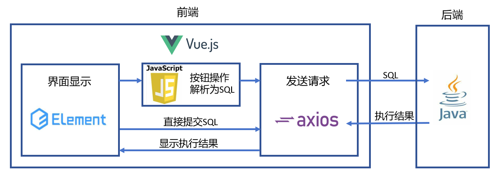

# 前端架构说明

## 架构图

## 代码说明

### `Requests.js`

对Axios进行封装的一个实例，配置HTTP请求。
设置基本配置: 使用Axios的create方法，设定默认URL和超时时间。
请求和响应拦截器: 通过拦截器，在请求发送前显示进度条，响应返回时关闭进度条，并处理成功和错误的响应。
定制请求方法: 为GET和POST请求提供了定制化的封装，使其调用更加方便。
导出封装后的模块: 使得封装后的功能可以在其他地方重复使用。

### `Sql.vue`

使用 Vue.js 和 Element Plus UI 库构建的单页面应用程序。一个简易的数据库管理系统（DBMS），允许用户执行一些基本的数据库操作，如查看数据库、表、添加或删除记录等。
* 用户可以通过输入 SQL 语句并提交来与数据库进行交互，表格会显示查询结果。
* 同时提供操作按钮用于添加、删除和修改数据，对话框用于输入新的数据行或修改现有数据。

 Script 部分（TypeScript）:

使用 Vue.js 的组合式 API (setup 函数、ref、reactive、computed 等)。
* defineProps 定义组件属性，这里定义了 msg 属性。
* ref 和 reactive 用于创建响应式数据，如对话框可见性 (addDialogVisible, altDialogVisible)、选中的索引 (activeIndex)、SQL 语句、表格数据 (tableData) 等。
* 一系列方法 (onClear, onSubmit, onHelp, onLook, handleDbRowOp, handleTableRowOp, handleTableRowDel, handleTableRowAdd, handleTableRowAddCommit, handleTableRowAlt, handleTableRowAltCommit) 定义了用户交互逻辑。
* etTableData 函数使用 requestPack.get 发送异步请求获取表格数据。

Template 部分:

使用 Element Plus 组件构建界面，如 el-container, el-header, el-menu, el-table, el-dialog 等。
* 有一个导航菜单和一个主区域，主区域包含一个用于显示数据库表格的区域和一个用于输入和提交 SQL 语句的表单。
* 表格根据 SQL 查询结果动态生成列和行。
* 提供了添加和修改数据的对话框。

Style 部分（Scoped CSS）:

* 使用 scoped CSS 为特定组件样式，例如 .flex-grow, .foot-item, .foot-bottom 等。

### SQL解析

以 handleTableRowDel 函数为例，展示如何将按钮操作转换为 SQL 语句。这个函数主要负责从表格中删除一行数据。在这个函数中，通过用户界面上的一个按钮操作（点击“删除”），解析出了一个完整的 SQL 删除语句，并执行这个语句来更新数据库。这个过程展示了如何将前端操作转换为后端数据库操作的逻辑。

当用户点击某个表格行的“删除”按钮时，会触发 handleTableRowDel 函数。该函数的主要目的是生成并执行一个删除特定数据库记录的 SQL 语句。

功能实现步骤
* 接收行数据：函数接收一个参数 row，它是一个对象，代表用户想要删除的表格行。这个对象通常包含了该行数据的唯一标识符，如 id。
* 构建删除 SQL 语句：函数首先确定用于标识记录的关键列（在这个例子中是 id）。然后，构建一个 SQL 删除语句，格式为：DELETE FROM [表名] WHERE [关键列]=[关键列的值];。在这里，[表名] 由 CurTableName.value 提供，它存储了当前选中的表名。[关键列的值] 由 row[id] 提供，代表用户选择删除的行的唯一标识符。
* 执行 SQL 语句：构建完 SQL 语句后，通过 getTableData 函数执行这个语句。在执行删除操作后，getTableData 可能还负责刷新表格，以显示最新的数据状态。